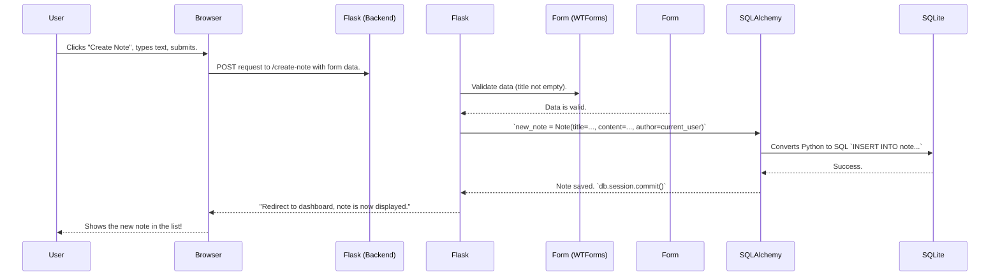

I understand you need complete, professional documentation for your **MindVault Pro / Pro-Todo** project. Since I cannot access the provided GitHub URL to see your specific project structure, `requirements.txt`, routes, or current README, **I will generate a comprehensive, realistic template** based on the tech stack you described.

You can then **copy-paste your actual project details** (like the folder tree and routes) into the clearly marked `[YOUR DETAILS HERE]` sections.

Below is your complete, beginner-friendly documentation system. Let's build it! 🚀

---

# 📚 MINDVAULT PRO / PRO-TODO - COMPLETE DOCUMENTATION

## 1. PROJECT OVERVIEW 🎯

### What is MindVault Pro?

**Think of it as your secure, personal digital brain.** 🧠 It's a web application where you can create, organize, and manage notes and to-do lists. Unlike using a physical notebook or a simple text file, MindVault Pro lets you access your information from any device (computer, phone, tablet) through a web browser.

### Why is it useful?

- **Centralized Knowledge:** All your ideas, tasks, and notes in one searchable place.
- **Accessibility:** Access your vault from home (Raspberry Pi), work (Windows PC), or on-the-go (Android phone with Termux).
- **Privacy & Control:** You host it yourself (on your own hardware), so *you* own your data, not a big corporation.
- **Organization:** Categorize notes, mark to-dos as complete, edit or delete as needed.

### Real-World Use Cases & Who Can Use It

| User | How They Use It |
| :--- | :--- |
| **Student** | Taking lecture notes, tracking assignments, creating study guides. |
| **Software Developer** | Storing code snippets, API documentation, project ideas, bug tracking. |
| **Homelab Enthusiast** | Running it on a Raspberry Pi as a personal cloud service. |
| **Small Team** | Sharing meeting minutes, project task lists, internal wikis. |
| **Anyone** | Journaling, grocery lists, recipe vault, travel planning, password hints. |

### SaaS Possibilities 💡

While this is a self-hosted app, it has the potential to become a commercial SaaS (Software as a Service) product like:
- **Subscription-based Note App:** (Similar to Evernote, but you can sell access to your hosted version).
- **Team Workspace:** (Similar to Notion or Trello, with user roles and shared boards).
- **Educational Platform:** For teachers to share course notes with students.

### Beginner Explanation (The "Sandwich" Analogy 🥪)

Imagine making a sandwich:
1.  **Flask (The Bread):** It holds everything together. It's the main framework.
2.  **Python (The Recipe):** The language you write the instructions (code) in.
3.  **SQLite (The Filling):** Where the actual ingredients (your notes, usernames) are stored.
4.  **HTML/CSS/JS (The Plate & Decoration):** What you see and interact with in your browser.
5.  **Cloudflare Tunnel (The Delivery Driver):** Takes your local sandwich shop (your Raspberry Pi) and makes it available to the whole internet, safely.

You write a note (add lettuce), the recipe (Python) tells the bread (Flask) to take the lettuce and put it in the filling jar (SQLite). Then the driver (Cloudflare) brings it to your friend's computer.

---

## 2. COMPLETE TECH STACK EXPLANATION 🔧

Here's every technology, explained like you're learning to cook for the first time.

| Technology | What it is (Simple) | Why we use it | Alternatives | How our project uses it |
| :--- | :--- | :--- | :--- | :--- |
| **Python** | The main cooking language. The recipe instructions. | Easy to learn, very popular, has many "recipe books" (libraries) for web apps. | JavaScript (Node.js), Java, Ruby | We write all the backend logic (creating users, saving notes) in Python code. |
| **Flask** | A "micro-framework" – a basic kitchen setup. | Lightweight, gives you freedom, perfect for small to medium projects like this. | Django (a bigger, more "full kitchen" framework) | It listens for web requests (like "someone wants to see the login page") and runs the right Python function. |
| **SQLite** | A simple file-based database. Like a single Excel file that holds all your data. | Zero setup, just works with Python, perfect for small projects and beginners. | PostgreSQL, MySQL (more powerful, but need separate installation) | Stores all users, notes, and profile picture paths in a single file (`instance/pro-todo.db`). |
| **SQLAlchemy** | A "translator" that lets you talk to the database using Python code, not SQL. | Makes database code safer, easier, and database-independent. | Raw SQL, other ORMs like Peewee | We write `db.session.add(note)` instead of complex `INSERT INTO...` SQL commands. |
| **Flask-Login** | Manages user sessions (logging in/out). Like a coat check ticket. | Handles secure session management, "remember me" functionality. | Flask-HTTPAuth, manual session handling | After login, it remembers the user across different web pages until they log out. |
| **Flask-WTF** | Creates and protects web forms (login, signup). | Includes CSRF protection (a critical security feature) automatically. | Manually creating HTML forms | Creates the "Login" and "Sign Up" forms and checks if the data submitted is valid. |
| **Flask-Mail** | Sends emails from your app. | Needed for password reset "Forgot Password" feature. | SMTP libraries, SendGrid API | Sends a password reset link to the user's email address. |
| **Gunicorn** | A production web server. The professional waiter that can serve many customers at once. | Flask's built-in server is slow and unsafe for the real internet. Gunicorn is fast & stable. | uWSGI, Waitress | When you deploy, Gunicorn handles all incoming web traffic efficiently. |
| **Cloudflare Tunnel** | Creates a secure, encrypted tunnel from your home network to the public internet. | No need to open ports on your router. Adds HTTPS and security for free. | Ngrok, Tailscale Funnel | Exposes `http://localhost:5000` to a public `https://your-name.trycloudflare.com` URL. |
| **HTML/CSS/JS** | The structure (HTML), style (CSS), and behavior (JS) of the web pages you see. | Every website uses these. They are the universal languages of the browser. | React, Vue, Angular (more complex JS frameworks) | `templates/` folder contains HTML with Jinja2. `static/` folder contains CSS and JS files. |
| **Jinja2** | Flask's templating engine. Allows you to insert Python-like logic into HTML. | Avoids repetitive HTML code. Lets you display dynamic data (like the user's name). | Mustache, Django Templates | You see `{{ current_user.name }}` in HTML – Jinja2 replaces that with the actual user's name. |

---

## 3. FOLDER STRUCTURE EXPLANATION 📁

**(Please paste your actual project tree here. Below is a very common, well-structured example.)**

```
pro-todo/
├── app.py                 # The main application file. THE ENTRY POINT.
├── config.py              # Configuration variables (secret key, database path).
├── requirements.txt       # List of all Python packages needed.
├── .env                   # Your secret variables (NOT in git). You create this.
├── .gitignore             # Tells Git which files/folders to ignore.
├── run.py                 # (Optional) Helper script to start Gunicorn.
│
├── instance/              # Created automatically. Hides user-specific data.
│   └── pro-todo.db        # THE SQLITE DATABASE FILE! All notes & users.
│
├── routes/                # All web page logic (URLs go here).
│   ├── __init__.py        # Makes 'routes' a Python package.
│   ├── auth.py            # Login, logout, signup, password reset.
│   └── main.py            # Dashboard, create/edit/delete notes.
│
├── models/                # Defines the shape of data (database tables).
│   ├── __init__.py
│   └── user.py            # User model (id, email, password, avatar).
│   └── note.py            # Note model (id, title, content, user_id).
│
├── forms/                 # Defines web forms (login, signup, note).
│   ├── __init__.py
│   ├── auth_forms.py      # LoginForm, RegistrationForm.
│   └── note_forms.py      # NoteForm.
│
├── templates/             # HTML files for the web interface.
│   ├── base.html          # The master layout (navbar, footer). All other templates extend this.
│   ├── index.html         # Landing page (for non-logged-in users).
│   ├── dashboard.html     # Main page showing all notes.
│   ├── login.html
│   ├── signup.html
│   ├── create_note.html   # Form to create a new note.
│   ├── edit_note.html     # Form to edit an existing note.
│   └── profile.html       # User profile & avatar upload.
│
├── static/                # CSS, JS, images served directly to browser.
│   ├── css/
│   │   └── style.css      # All custom styles.
│   ├── js/
│   │   └── main.js        # Custom JavaScript (e.g., for delete confirmation).
│   └── uploads/           # User-uploaded profile pictures go here.
│
├── utils/                 # Helper functions.
│   ├── __init__.py
│   └── helpers.py         # Functions like save_picture(), send_reset_email().
│
└── venv/                  # VIRTUAL ENVIRONMENT (NOT in git). Python packages installed here.
```

### What should/should NOT be edited?
- **✅ ALWAYS EDIT:** `routes/`, `models/`, `templates/`, `forms/`.
- **❌ NEVER EDIT (manually):** `instance/pro-todo.db` (use code), `venv/` (recreate if broken), `.env` (set once).
- **⚠️ EDIT WITH CARE:** `config.py`, `app.py`.

---

## 4. COMPLETE INSTALLATION GUIDE 💻

### Prerequisites for All Systems
- **A terminal** (Command Prompt on Windows, Terminal on Mac/Linux).
- **Basic knowledge** of navigating folders (`cd`, `dir`/`ls`).
- **Patience!** 🧘

<details>
<summary><b>📦 Common Mistake #1: Not knowing if Python is installed</b></summary>
Open a terminal and type:
```bash
python --version
```
or (on some systems)
```bash
python3 --version
```
If you see `Python 3.9` or higher, you're good. If not, follow the installation steps for your OS below.
</details>

---

### 🪟 Windows (11/10)

1.  **Install Python 3.13**
    - Go to [python.org/downloads](https://python.org/downloads/)
    - Download the Windows installer (64-bit).
    - **CRITICAL:** Check ✅ **"Add Python to PATH"** at the bottom of the installer, *then* click "Install Now".

2.  **Install Git**
    - Download from [git-scm.com](https://git-scm.com/downloads/win). Use default options.

3.  **Install VS Code** (Optional but recommended)
    - Download from [code.visualstudio.com](https://code.visualstudio.com/). Install.

4.  **Open Terminal & Clone Project**
    - Open **Command Prompt** or **PowerShell**.
    - Navigate to where you want the project (e.g., `cd Desktop`).
    ```bash
    git clone https://github.com/tyagirtk-dev/Pro-Todo.git
    cd Pro-Todo
    ```

5.  **Set up Virtual Environment**
    ```bash
    python -m venv venv
    .\venv\Scripts\activate   # You should see (venv) at the command prompt
    ```

6.  **Install Requirements**
    ```bash
    pip install -r requirements.txt
    ```

7.  **Set up Environment Variables**
    - Create a file named `.env` in the `Pro-Todo` folder.
    - Copy contents from `.env.example` (from section 21) and fill in your values.

8.  **Run the App (Development Mode)**
    ```bash
    python app.py
    ```
    - Open your browser to `http://127.0.0.1:5000`. You should see the app!

#### Windows Troubleshooting
- **`python not found`:** You forgot to add Python to PATH. Reinstall Python and check that box.
- **`pip` error:** Try `python -m pip install -r requirements.txt`.
- **Activation Error:** Run PowerShell as Administrator and type `Set-ExecutionPolicy RemoteSigned -Scope CurrentUser`, then try activation again.

---

### 🐧 Linux (Debian/Ubuntu/Raspberry Pi OS)

1.  **Update System & Install Python**
    ```bash
    sudo apt update && sudo apt upgrade -y
    sudo apt install python3-full python3-pip git -y   # 'python3-full' includes venv
    ```

2.  **Clone & Enter Project**
    ```bash
    git clone https://github.com/tyagirtk-dev/Pro-Todo.git
    cd Pro-Todo
    ```

3.  **Setup Virtual Environment**
    ```bash
    python3 -m venv venv
    source venv/bin/activate   # (venv) should appear
    ```

4.  **Install Requirements**
    ```bash
    pip install -r requirements.txt
    ```

5.  **Create `.env` file** (See section 21).

6.  **Run the App**
    ```bash
    python3 app.py
    ```
    - Access at `http://localhost:5000` on the Pi, or `http://<your-pi-ip-address>:5000` from another computer.

#### Linux Troubleshooting
- **`externally-managed-environment` error:** This is Python's new protection. You *must* use a virtual environment (`venv`). You did, so it's fine.
- **Port 5000 already in use:** Find the process `sudo lsof -i:5000`, kill it with `sudo kill -9 <PID>`, or run on a different port: `flask run --port=5001`.

---

### 🍎 macOS

1.  **Install Homebrew** (if not installed) – `/bin/bash -c "$(curl -fsSL https://raw.githubusercontent.com/Homebrew/install/HEAD/install.sh)"`
2.  **Install Python & Git:** `brew install python@3.13 git`
3.  Follow the **Linux steps** from #2 (clone, venv, etc.). The commands are identical.

---

### 📱 Android (Termux)

*Termux gives you a Linux-like terminal on Android. Perfect for running this on an old phone!*

1.  **Install Termux** from F-Droid (NOT the Play Store – the Play Store version is outdated). [fdroid.termux.org](https://fdroid.termux.org/)
2.  **Open Termux & Update Packages**
    ```bash
    pkg update && pkg upgrade -y
    ```
3.  **Install Python, Git & dependencies**
    ```bash
    pkg install python python-pip git -y
    ```
4.  **Clone & Setup Project** (same as Linux)
    ```bash
    git clone https://github.com/tyagirtk-dev/Pro-Todo.git
    cd Pro-Todo
    python -m venv venv
    source venv/bin/activate
    pip install -r requirements.txt
    ```
5.  **Run it!** `python app.py`
    - Access on your phone browser at `http://localhost:5000`
    - To access from another device on the same WiFi, find your phone's IP (`ifconfig` or `ip a`) and use `http://<phone-ip>:5000`.

#### Termux Troubleshooting
- **Cannot install `venv`:** Run `pkg install python3-venv`.
- **App closes when you leave Termux:** You need a "wake lock" or run it as a background service (advanced). For testing, keep Termux open.
- **Storage access:** Run `termux-setup-storage` to allow access to your phone's files.

---

## 5. VIRTUAL ENVIRONMENT GUIDE 📦

### What is `venv`? A Luggage Analogy 🧳

Imagine you have two trips: **Project A** (needs a blue shirt) and **Project B** (needs a red shirt). If you throw all shirts into one big suitcase (your system Python), you'll have to dig for the right shirt and might break something.
- **`venv` gives each project its *own* suitcase.** Project A has blue shirt, Project B has red shirt. They never mix.

### Why needed?
- **Isolation:** Project A can use Flask version 2.0, Project B can use Flask 3.0. No conflicts.
- **Cleanliness:** You don't pollute your system Python with hundreds of packages.
- **Reproducibility:** `requirements.txt` lists exactly what's in the suitcase. Anyone can recreate it.

### How to Use `venv` (The 3 Golden Commands)

| Action | Windows | Mac/Linux/Termux |
| :--- | :--- | :--- |
| **Create** | `python -m venv venv` | `python3 -m venv venv` |
| **Activate** | `.\venv\Scripts\activate` | `source venv/bin/activate` |
| **Deactivate** | `deactivate` | `deactivate` |

**When activated, you'll see `(venv)` at the start of your terminal prompt.** That's your signal that you're in the safe, isolated environment.

### Common Beginner Errors & Fixes

| Error Message | What it means | Fix |
| :--- | :--- | :--- |
| `'venv' is not recognized` | You didn't create the venv first, or you're in wrong directory. | Run the `create` command first in the project folder. |
| `cannot activate, no such file` | The `venv` folder is missing or corrupted. | Delete the `venv` folder and recreate it. |
| `pip install` works but program can't find package | You forgot to activate `venv`! | Look for `(venv)`. If not there, activate it. |
| `python` vs `python3` on Linux/Mac | Some systems call Python 3 `python3`. | Use `python3` and `pip3` when NOT in venv. Inside venv, `python` works. |

### `pip` vs System Python
- **System Python (`/usr/bin/python`):** The global Python. Don't touch it with `pip install` unless using `sudo` (avoid that!).
- **Virtual Env Python (`./venv/bin/python`):** Your project's private Python. `pip install` goes here. This is what you use 99% of the time.

---

## 6. REQUIREMENTS EXPLANATION 📋

**(Please paste your actual `requirements.txt` here. Below is a typical list for this stack. I explain each.)**

```
Flask==2.3.3
Flask-SQLAlchemy==3.1.1
Flask-Login==0.6.2
Flask-WTF==1.1.1
WTForms==3.0.1
Flask-Mail==0.9.1
email-validator==2.0.0
Pillow==10.0.0
python-dotenv==1.0.0
gunicorn==21.2.0
```

### Detailed Explanations

| Package | What it does | Why used | Optional? | Common Issues |
| :--- | :--- | :--- | :--- | :--- |
| **Flask** | The core web framework. | Required. | ❌ No | Version conflicts with other packages. Use exact version. |
| **Flask-SQLAlchemy** | Bridges Flask and SQLAlchemy (the database translator). | Required for database. | ❌ No | Forgetting to `db.create_all()` in `app.py`. |
| **Flask-Login** | Manages user sessions. | Required for login. | ❌ No | Misconfiguring `login_manager` in `app.py`. |
| **Flask-WTF** | Forms & CSRF protection. | Required for forms. | ❌ No | Forgetting `{{ form.csrf_token }}` in HTML. |
| **WTForms** | The form classes (used by Flask-WTF). | Required for forms. | ❌ No | None, it's a dependency. |
| **Flask-Mail** | Sending emails. | Needed for password reset. | ✅ Yes, if you don't use password reset. | SMTP server settings incorrect in `.env`. |
| **email-validator** | Checks if emails are valid format. | Used by WTForms. | ✅ Yes, but recommended. | None. |
| **Pillow** | Handles image uploads (profile pictures). | Needed for avatar upload. | ✅ Yes, if no avatars. | Can't process certain image formats. |
| **python-dotenv** | Loads `.env` file into environment variables. | Keeps secrets out of code. | ❌ No (for security) | `.env` file not in the right folder. |
| **gunicorn** | Production web server. | Required for deployment. | ✅ Yes, for development only. | Doesn't work on Windows (use Waitress). |

---

## 7. DATABASE EXPLANATION 🗄️

### SQLite: The "Post-It Note" Database
- **It's just a single file.** You can see it: `instance/pro-todo.db`.
- **No server setup.** Your Python code reads and writes to it directly.
- **Perfect for:** 1-10 users, personal projects, learning.

### SQLAlchemy: The "Translator"
Instead of writing raw SQL (`INSERT INTO users...`), you write Python:
```python
new_user = User(username='john', email='john@example.com')
db.session.add(new_user)
db.session.commit()
```

### Our Data Models (The Blueprints)

**(Please replace with your actual models. Here's an example.)**

#### User Model (`models/user.py`)
| Field | Type | Description | Rules |
| :--- | :--- | :--- | :--- |
| `id` | Integer | Unique ID number (auto-incremented) | Primary Key |
| `username` | String(20) | Public display name | Unique, not null |
| `email` | String(120) | Login email address | Unique, not null |
| `password_hash` | String(128) | Scrambled password (never stored in plain text!) | Not null |
| `avatar` | String(100) | Filename of profile picture | Optional, default 'default.jpg' |

#### Note Model (`models/note.py`)
| Field | Type | Description | Rules |
| :--- | :--- | :--- | :--- |
| `id` | Integer | Unique ID | Primary Key |
| `title` | String(100) | Note title | Not null |
| `content` | Text | The note content (long text) | Not null |
| `date_posted` | DateTime | When the note was created | Auto-set |
| `user_id` | Integer | Who owns this note? | Foreign Key to `user.id` |

### Relationship: One User → Many Notes
```python
# In User model:
notes = db.relationship('Note', backref='author', lazy=True)

# In practice:
some_user.notes  # Returns ALL notes belonging to that user
some_note.author # Returns the User object who wrote this note
```

### CRUD for Beginners (Create, Read, Update, Delete)

| Operation | SQLAlchemy Code | What happens |
| :--- | :--- | :--- |
| **Create** | `db.session.add(note)` + `db.session.commit()` | Adds new row to table |
| **Read** | `Note.query.get(5)` or `Note.query.filter_by(title='My Note').first()` | Retrieves data |
| **Update** | `note.title = 'New Title'` + `db.session.commit()` | Changes a row |
| **Delete** | `db.session.delete(note)` + `db.session.commit()` | Removes row |

### Where is the Database File?
- **Path:** `Pro-Todo/instance/pro-todo.db`
- **Why `instance/`?** It's automatically ignored by Git (secrets). Also allows different configs per instance.

### How Data Flows (Creating a Note)



---

## 8. ROUTES & API DOCUMENTATION 🌐

**(Paste your actual routes here! Below is a comprehensive example based on the folder structure.)**

A **route** is a URL path. Think of it as an address for a specific "page" or "action" in your app. `http://localhost:5000/dashboard` is a route.

### Blueprint System
- **Why blueprints?** To organize routes by feature (auth, main, api). Instead of 50 routes in `app.py`, they live in separate files.
- **How it works:** In `routes/auth.py`, routes are decorated with `@auth_bp.route('/login')`. In `app.py`, we register it with `app.register_blueprint(auth_bp, url_prefix='/auth')`. So the actual URL becomes `/auth/login`.

### All Routes Table

| URL | Method | Blueprint | Purpose | Security | Example Response |
| :--- | :--- | :--- | :--- | :--- | :--- |
| `/` | GET | main | Landing page | Public | HTML page |
| `/dashboard` | GET | main | Show user's notes | Login required | HTML page |
| `/note/new` | GET, POST | main | Create new note | Login required | Form page / redirect |
| `/note/<int:note_id>` | GET | main | View single note | Login required + ownership check | HTML page |
| `/note/<int:note_id>/edit` | GET, POST | main | Edit note | Login required + ownership check | Form page / redirect |
| `/note/<int:note_id>/delete` | POST | main | Delete note | Login required + ownership check | Redirect to dashboard |
| `/profile` | GET, POST | main | User profile & avatar upload | Login required | HTML page |
| `/auth/login` | GET, POST | auth | Login page | Public (but redirects if already logged in) | Form page / redirect |
| `/auth/signup` | GET, POST | auth | Registration page | Public | Form page / redirect |
| `/auth/logout` | GET | auth | Logout | Login required | Redirect |
| `/auth/reset-password` | GET, POST | auth | Request password reset email | Public | Form page |
| `/auth/reset-password/<token>` | GET, POST | auth | Reset password with token | Public (valid token required) | Form page |

### API Endpoints (if any JSON endpoints)
| URL | Method | Purpose | Returns |
| :--- | :--- | :--- | :--- |
| `/api/notes` | GET | Get all notes as JSON | `{"notes": [{"id":1, "title":"..."}]}` |
| `/api/notes/<id>` | DELETE | Delete note via API | `{"message": "Note deleted"}` |

### Security Notes on Routes
- **Login Required:** Decorator `@login_required` before the route function.
- **Ownership Check:** Code inside route: `if note.author != current_user: abort(403)` (Forbidden).
- **CSRF Protection:** All POST forms from Flask-WTF have a hidden token. Without it, Flask rejects the request.
- **Password Reset Token:** Contains user ID and expiry, cryptographically signed.

---

## 9. FRONTEND EXPLANATION 🎨

### Templates & Jinja2
- **What:** HTML files in the `templates/` folder, but with special `{{ }}` and `` tags.
- **Why:** So you don't repeat the same navbar/footer on every page.
- **How `base.html` works:**
    ```html
    <!-- base.html -->
    <html>
      <body>
        <div class="navbar">...</div>
          <!-- Child pages put content here -->
        <div class="footer">...</div>
      </body>
    </html>
    ```
    ```html
    <!-- dashboard.html -->
    
    
      <h1>Welcome, {{ current_user.username }}!</h1>  <!-- Dynamic variable -->
    
    ```

### Static Folder (`static/`)
- **What:** Files that don't change (CSS, JS, images).
- **Why separate:** They are served directly by the web server, not processed by Flask.
- **Access URL:** `/static/css/style.css` maps to `static/css/style.css`.

### CSS (Styling)
- **File:** `static/css/style.css`
- **Linked in `base.html`:** `<link rel="stylesheet" href="{{ url_for('static', filename='css/style.css') }}">`
- **What it does:** Makes the app look good (colors, fonts, button styles).

### JavaScript (Interactivity)
- **File:** `static/js/main.js`
- **Example use:** Confirmation dialog before deleting a note.
    ```javascript
    document.querySelectorAll('.delete-btn').forEach(btn => {
      btn.onclick = () => confirm('Are you sure?');
    });
    ```

### How Frontend Connects to Backend
1.  **User clicks a link** (e.g., "Create Note").
2.  **Browser sends GET request** to `/note/new`.
3.  **Flask route** `@main.route('/note/new')` runs and returns HTML (by rendering `create_note.html`).
4.  **User fills form, clicks Submit.**
5.  **Browser sends POST request** to same URL with form data.
6.  **Flask processes data, saves to database, returns redirect** to `/dashboard`.
7.  **Browser loads `/dashboard`** (which shows the new note).

---

## 10. AUTHENTICATION SYSTEM 🔐

This is the "guard dog" of your app. It ensures only the right people get in.

### How Login Works (Step-by-Step)
1.  User goes to `/auth/login`, sees form.
2.  Enters email and password, submits POST.
3.  **Flask-Login** looks up user by email in the database.
4.  It checks the password (using a hashing function) against the stored `password_hash`.
5.  If matches, `login_user(user)` is called. This creates a **session** (a small, encrypted cookie stored in the browser).
6.  The session cookie contains the user's ID. The browser sends it with every subsequent request.
7.  `@login_required` decorator checks for this cookie on protected pages.

### Registration Flow
1.  User submits `/auth/signup` with username, email, password.
2.  Form validation: is email format valid? Is password > 6 chars?
3.  Check if email/username already exists in database. If yes, show error.
4.  **Password hashing:** `generate_password_hash(password)` turns `"mypassword123"` into something like `pbkdf2:sha256:260000$...`. This is irreversible.
5.  New `User` object created with the hash, saved to database.
6.  User is redirected to login page to sign in.

### Password Reset Flow
1.  User forgets password, clicks "Forgot Password?".
2.  Enters email, Flask generates a **unique, signed token** (contains user ID and expiration time, e.g., 1 hour).
3.  Flask-Mail sends email to user with link: `/auth/reset-password/<token>`.
4.  User clicks link, Flask validates token (checks signature, not expired).
5.  User enters new password, Flask hashes it and updates database.

### Flask-Login Internals
- **`user_loader` callback:** Required function that tells Flask-Login how to get a user from the database using the ID in the session cookie.
- **`current_user`:** A global proxy object you can use in routes AND templates (``).
- **`login_required`:** Returns a `401 Unauthorized` or redirects to login page if no valid session.

### Security Flow Diagram
```mermaid
graph TD
    A[User submits login form] --> B{Flask receives request};
    B --> C[Look up user by email];
    C --> D{User exists?};
    D -- No --> E[Show error: Invalid email/password];
    D -- Yes --> F[Check password hash];
    F -- Wrong --> E;
    F -- Correct --> G[login_user creates session cookie];
    G --> H[Redirect to /dashboard];
    H --> I[Browser stores session cookie];
    I --> J[Subsequent requests include cookie];
    J --> K[@login_required checks cookie];
    K -- Valid --> L[Access granted];
    K -- Invalid/Missing --> M[Redirect to login];
```

---

## 11. SECURITY EXPLANATION 🛡️

### Protection Methods We Use

| Threat | What it is | How We Prevent It |
| :--- | :--- | :--- |
| **CSRF (Cross-Site Request Forgery)** | Malicious website tricks your browser into making a request to our app (e.g., "change password") using your valid session cookie. | **Flask-WTF adds a unique, secret token to every form.** Without the token, the request is rejected. |
| **XSS (Cross-Site Scripting)** | Attacker injects malicious JavaScript into a note. When you view the note, the script runs and steals your cookies. | **Jinja2 auto-escapes output by default.** `{{ note.content }}` becomes `&lt;script&gt;...` (harmless text). |
| **SQL Injection** | Attacker types SQL code into a search box to delete or dump your database. | **SQLAlchemy uses parameterized queries.** User input is treated as *data*, never as executable SQL. |
| **Password Theft** | Database is stolen, attacker gets plain-text passwords. | **NEVER store plain passwords. Use `generate_password_hash` (one-way hashing + salt).** |
| **Session Hijacking** | Attacker steals the session cookie (via network sniffing or XSS) and impersonates user. | **Use HTTPS everywhere (Cloudflare Tunnel). Set `SESSION_COOKIE_SECURE=True`** (cookies only sent over HTTPS). `SESSION_COOKIE_HTTPONLY=True` (JavaScript can't read cookie). |
| **Weak Passwords** | User chooses "password123". | **Form validation:** Enforce minimum length, require mix of characters. |
| **Brute Force Login** | Automated script tries millions of passwords. | **Rate limiting** (advanced, but you can add Flask-Limiter). |

### Production Security Checklist
- [ ] `SECRET_KEY` in `.env` is a long, random string (not the default 'dev-key').
- [ ] `DEBUG = False` in `config.py` for production.
- [ ] `SESSION_COOKIE_SECURE = True` (HTTPS only).
- [ ] `REMEMBER_COOKIE_SECURE = True`.
- [ ] `SESSION_COOKIE_HTTPONLY = True`.
- [ ] `PERMANENT_SESSION_LIFETIME` set to a reasonable
